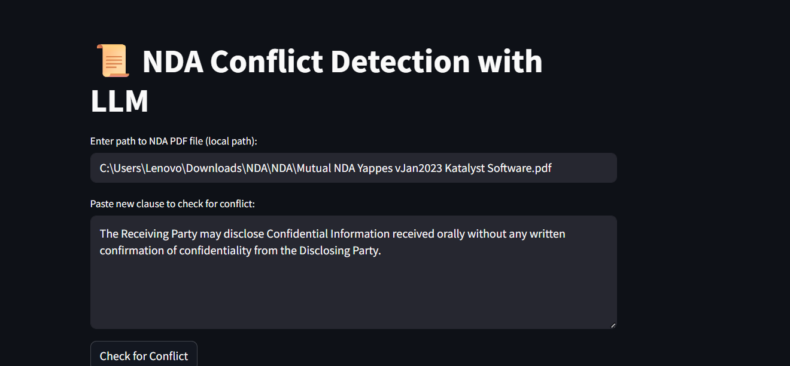
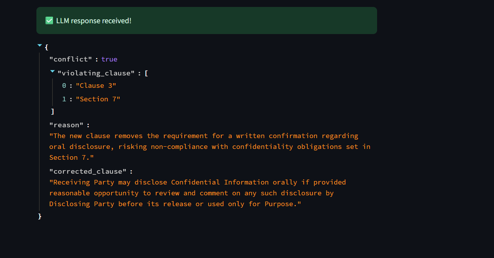

# NDA Clause Conflict Checker API

This project provides a **FastAPI**-based REST API that checks for conflicts between a new NDA clause and an existing NDA document using a Large Language Model (LLM). The application is packaged as a Docker container and can be deployed locally or to cloud platforms.

---

## 🧠 How It Works (Technical Architecture)

This app follows a **retrieval-augmented generation** pipeline consisting of:

### 1. 📄 PDF Text Extraction

- The NDA document is uploaded from the **local path**.
- Text is extracted using `pdfminer`.

### 2. Chunking (Context Window Creation)

- Extracted text is broken into overlapping paragraph-based chunks.
- This ensures contextual continuity between clauses and sections.

### 3. Semantic Embedding + FAISS Index

- Chunks are embedded using all-MiniLM-L6-v2 from SentenceTransformers.
- A FAISS index allows for quick similarity search between the new clause and NDA chunks.

### 4. Contextual Retrieval

- The new clause is embedded and compared against the stored FAISS index.
- Top k most relevant NDA sections are selected to form the context for the LLM prompt.

### 5. Querying the LLM (DeepSeek via Ollama)

- The new clause and retrieved NDA context are passed to a structured prompt.
- This is sent to a locally hosted DeepSeek model via the Ollama API.

---

## How the UI Works (Streamlit Interface)

This app is built with Streamlit and provides a clean, minimal interface for interactive legal review.

### Step 1: Upload & Input Clause

- Enter path to NDA PDF (must be local).
- Paste the new clause you want to check.
- Click “Check for Conflict”.

### Step 2. LLM Conflict Analysis

- PDF is processed
- The LLM:
  - Detects any conflicts
  - Explains why they occur
  - Returns a revised version of the clause
- Result is shown in valid JSON format for easy interpretation.

## Features

- Local PDF parsing (no cloud storage)

- Semantic clause retrieval using FAISS + SBERT

- LLM-powered legal conflict detection

- Structured JSON output

- Locally run DeepSeek via Ollama (offline inference)

- Simple and intuitive Streamlit interface

